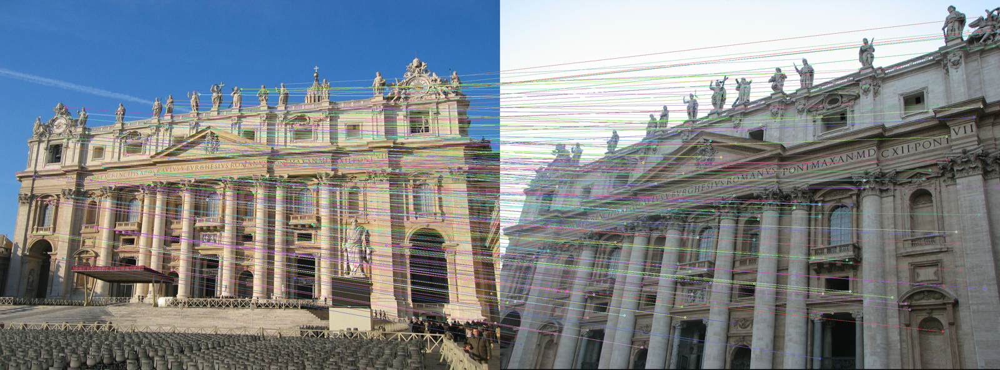
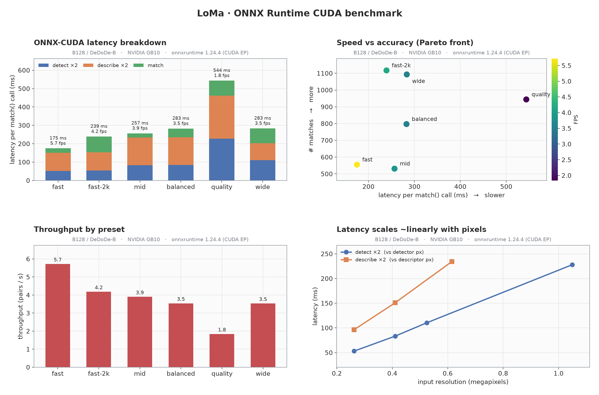
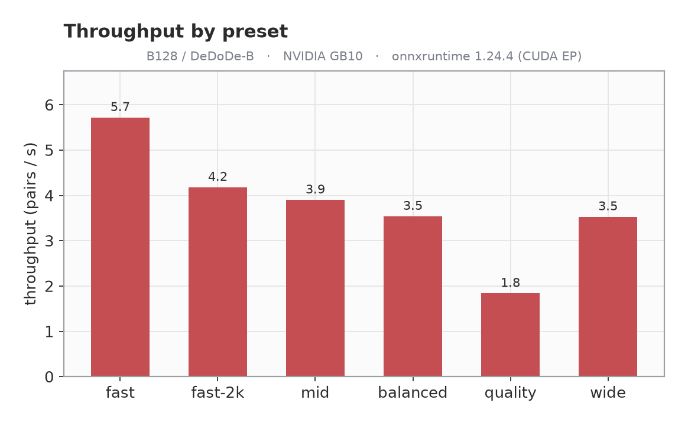
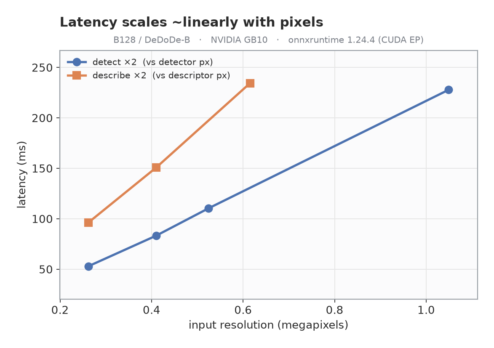

# LoMa · ONNX export + C++ / Jetson / DGX-Spark deployment

Export every [LoMa](https://github.com/davnords/LoMa) model to **ONNX**, run it on **GPU
via ONNX Runtime (CUDA EP)**, and deploy it from a small **reusable C++ library** — with
resolution/keypoint **presets** tuned for the Jetson Orin Nano 8 GB and a full
**benchmark + validation** suite. The original PyTorch code is untouched; everything here
lives alongside it.

<p align="center"></p>
<p align="center"><sub>LoMa B128 via ONNX Runtime — 1117 correspondences on a wide-baseline pair (220 drawn)</sub></p>

<p align="center"></p>

## Highlights
- **All 5 variants exported** (B, B128, R, L, G) + a shared detector and per-arch
  descriptors — each a single self-contained `.onnx`.
- **ONNX == PyTorch**: matchers agree **100%** (99.95% for B128), descriptors **cosine 1.0**,
  end-to-end **99.5% of matches within 1 px**.
- **Runs on GPU via ONNX Runtime CUDA EP** — including a from-source `onnxruntime-gpu`
  build for the **DGX Spark GB10** (sm_121, CUDA 13), where no prebuilt wheel exists.
- **C++ library** (`cpp/`) with a 3-line API, CUDA→CPU fallback, and `find_package(LoMa)`.
- **Presets** (`fast` / `balanced` / `quality` / `wide` / …) trade latency for matches.

---

## Model zoo (`onnx/`)
Each LoMa model is a 3-stage pipeline; stages are exported separately so the heavy
detector/descriptor are **shared** instead of duplicated per variant.

| stage | file | size | notes |
|-------|------|------|-------|
| **detector** (DaD) | `loma_detector_<preset>.onnx` | ~26 MB | shared by all variants; resolution + keypoints baked in |
| **descriptor** DeDoDe-B | `loma_descriptor_dedode_b_<preset>.onnx` | 54 MB | 128-d, light — **use this on 8 GB** |
| **descriptor** DeDoDe-G | `loma_descriptor_dedode_g.onnx` | 1.3 GB | 256-d, + DINOv2 ViT-L |
| **matcher** | `loma_matcher_{B128,B,R,L,G}.onnx` | 47 / 47 / 47 / 183 / 725 MB | per variant, dynamic shapes |

| variant | descriptor | desc dim | matcher | good for |
|---------|-----------|----------|---------|----------|
| **B128** | DeDoDe-B | 128 | 47 MB | **Orin Nano / real-time** |
| B | DeDoDe-G | 256 | 47 MB | accuracy, has GPU/VRAM |
| R | DeDoDe-G | 256 | 47 MB | rotation-invariant (aerial) |
| L | DeDoDe-G | 256 | 183 MB | higher accuracy |
| G | DeDoDe-G | 256 | 725 MB | best accuracy |

> Some files exceed GitHub's 100 MB limit (`loma_matcher_G`, `loma_matcher_L`,
> `loma_descriptor_dedode_g`). Ship them via **GitHub Releases** or **Git LFS** —
> they're git-ignored by default. Regenerate any model with `export_onnx.py` /
> `export_jetson.py`.

---

## Benchmark (NVIDIA GB10, onnxruntime 1.24.4 CUDA EP, B128/DeDoDe-B)
`total` is the cost of one `match()` (detect ×2 + describe ×2 + match). `fidelity` =
fraction of ONNX matches within 2 px of PyTorch.

| preset | detector | desc | kpts | total | FPS | #matches | fidelity |
|--------|----------|------|------|-------|-----|----------|----------|
| **fast** | 512² | 512 | 1024 | **175 ms** | **5.7** | 555 | 99.5% |
| **fast-2k** | 512² | 512 | 2048 | 239 ms | 4.2 | **1117** | 99.5% |
| mid | 640² | 640 | 1024 | 257 ms | 3.9 | 531 | 99.8% |
| balanced | 640² | 640 | 1536 | 283 ms | 3.5 | 797 | 99.3% |
| quality | 1024² | 784 | 2048 | 544 ms | 1.8 | 944 | 99.4% |
| **wide** | 512×1024 | 512 | 2048 | 283 ms | 3.5 | **1093** | 99.5% |

<p align="center"></p>

> **Insight:** on B128, *more keypoints* beats *more resolution*. `fast-2k` (512² + 2048 kpts)
> finds **more** matches than `quality` (1024²) at **half** the latency — `quality` is
> Pareto-dominated. Pick `fast` for pure speed, `fast-2k`/`wide` for the most matches.
> GB10 is far faster than the Orin Nano — run `cpp/loma_bench` on-device for target numbers.

---

## Quickstart — Python (ONNX Runtime)
```bash
pip install -r requirements.txt
pip install "lomatch @ git+https://github.com/davnords/LoMa.git"   # provides the `loma` package

uv run export_onnx.py   --variants B128            # detector + descriptor + matcher
uv run export_jetson.py --presets fast wide --archs dedode_b   # optimized presets
uv run compare_onnx.py                             # ONNX-vs-PyTorch end-to-end check
uv run bench_sweep.py                              # benchmark + charts (needs CUDA EP)
```

## Quickstart — C++ (3 lines)
```cpp
loma::Options o;
o.detector_path="onnx/loma_detector_fast.onnx";
o.descriptor_path="onnx/loma_descriptor_dedode_b_fast.onnx";
o.matcher_path="onnx/loma_matcher_B128.onnx";
o.detector_size=512; o.descriptor_size=512; o.num_keypoints=1024; o.descriptor_dim=128;

loma::LoMa model(o);                       // CUDA EP → CPU fallback
auto matches = model.match(imgA, imgB);    // std::vector<loma::Match>{a,b,score}
```
Build + integrate: see **[cpp/README.md](cpp/README.md)**.

---

## ONNX Runtime on GPU (aarch64 / Blackwell)
`pip install onnxruntime-gpu` has **no aarch64 + CUDA wheel**. Options:

- **Jetson Orin**: use JetPack's `onnxruntime-gpu` (CUDA EP ready) — point CMake at `/usr`.
- **DGX Spark / GB10 (sm_121, CUDA 13)**: build from source (no prebuilt wheel exists):
  ```bash
  ./build_ort_gpu.sh     # clones ORT v1.24.4, builds with CMAKE_CUDA_ARCHITECTURES=121,
                         # installs the cp3x wheel, verifies CUDAExecutionProvider
  ```
  or grab prebuilt C++ libs from
  [Albatross1382/onnxruntime-aarch64-cuda-blackwell](https://github.com/Albatross1382/onnxruntime-aarch64-cuda-blackwell).
  **Use FP32 models** — sm_121 has no INT8 kernels (our exports are FP32 ✓).
- **Python on aarch64 GPU**: only via a from-source wheel; otherwise the Python GPU
  runtime is PyTorch CUDA (the ONNX models reproduce it bit-for-bit).

---

## Validation — ONNX reproduces PyTorch
| stage | metric | result |
|-------|--------|--------|
| detector | keypoint-set agreement / probs max-diff | 99.4–99.85% / ~5e-8 |
| descriptor (B) | cosine similarity (mean / min) | 1.00000 / 1.0000 |
| matcher | match-index agreement | **100%** (B/R/L/G), 99.95% (B128) |
| **end-to-end** (B128) | matches & ≤1 px overlap | 984 vs 984, **99.5%** |

The small residual is `topk` tie-reordering + fp32 GPU↔CPU rounding, not a graph error.

---

## Repo layout (added on top of upstream LoMa)
```
export_onnx.py       export detector/descriptor/matcher to ONNX (+ validate)
export_jetson.py     resolution/keypoint presets (fast/balanced/quality/wide)
compare_onnx.py      end-to-end ONNX-vs-PyTorch comparison
bench_sweep.py       GPU benchmark sweep + charts  → docs/
benchmark_gpu.py     PyTorch-CUDA latency reference
viz_matches.py       qualitative match figure (docs/matches.png)
build_ort_gpu.sh     build onnxruntime-gpu for DGX Spark GB10 (sm_121)
cpp/                 reusable C++ library (ORT + OpenCV), CMake, examples
onnx/                exported models           docs/  charts + benchmark.json
```

## Publishing
**As a standalone repo** (`loma-onnx`):
```bash
git init && git add export_*.py compare_onnx.py bench_sweep.py benchmark_*.py \
    build_ort_gpu.sh cpp/ docs/ ONNX_DEPLOY.md
# ship models as release assets (they're git-ignored): gh release create v1.0 onnx/*.onnx
```
Use `ONNX_DEPLOY.md` as the repo `README.md`. Attach the exported `.onnx` files to a
GitHub Release (or track with Git LFS) since several exceed 100 MB.

**As a PR to upstream LoMa**: see [`PR_DESCRIPTION.md`](PR_DESCRIPTION.md) — adds the
export scripts, the C++ library, and this guide without touching the PyTorch code.

## How it was exported (notes for reproducers / upstream PR)
- Uses the **dynamo (torch.export) ONNX exporter** — the legacy TorchScript exporter
  emits ORT-invalid graphs here (bad `Concat` axis, `MaxPool` dilations).
- DINOv2's `@torch.compiler.disable` + internal `inference_mode` are stripped for export.
- The detector's torchvision `Normalize` (data-dependent branch) is swapped for plain
  arithmetic so `torch.export` can trace it; detector exports static (dynamic batch hits
  `if B == 0`).
- Weights are consolidated into single self-contained `.onnx` files.

Thanks to the LoMa authors (Nordström, Edstedt, et al.) and Parskatt — see the upstream
[README](README.md) for the papers and citation.
