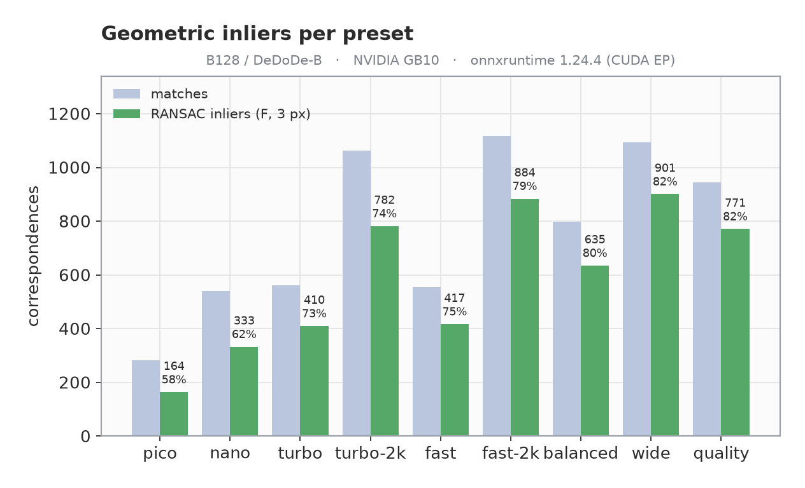
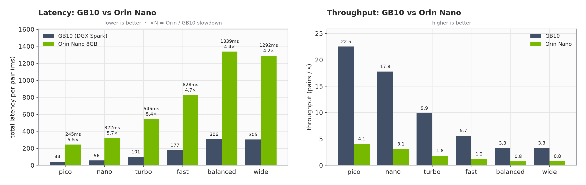
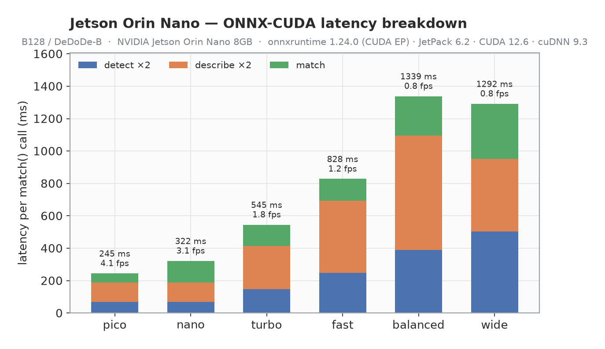

# LoMa · ONNX export + C++ / Jetson / DGX-Spark deployment

Export every [LoMa](https://github.com/davnords/LoMa) model to **ONNX**, run it on **GPU
via ONNX Runtime (CUDA EP)**, and deploy it from a small **reusable C++ library** — with
resolution/keypoint **presets** tuned for the Jetson Orin Nano 8 GB and a full
**benchmark + validation** suite. The original PyTorch code is untouched; everything here
lives alongside it.

<p align="center"></p>
<p align="center"><sub>LoMa B128 via ONNX Runtime — 1117 correspondences on a wide-baseline pair (220 drawn)</sub></p>

<p align="center"></p>

## Highlights
- **All 5 variants exported** (B, B128, R, L, G) + a shared detector and per-arch
  descriptors — each a single self-contained `.onnx`.
- **ONNX == PyTorch**: matchers agree **100%** (99.95% for B128), descriptors **cosine 1.0**,
  end-to-end **99.5% of matches within 1 px**.
- **Runs on GPU via ONNX Runtime CUDA EP** — including a from-source `onnxruntime-gpu`
  build for the **DGX Spark GB10** (sm_121, CUDA 13), where no prebuilt wheel exists.
- **C++ library** (`cpp/`) with a 3-line API, CUDA→CPU fallback, and `find_package(LoMa)`.
- **Presets** from `pico` (256², **22 FPS**) → `nano` → `turbo` → `fast` → `quality` (1024²),
  plus landscape `wide` (512×1024) — trade latency for matches.

---

## Model zoo (`onnx/`)
Each LoMa model is a 3-stage pipeline; stages are exported separately so the heavy
detector/descriptor are **shared** instead of duplicated per variant.

| stage | file | size | notes |
|-------|------|------|-------|
| **detector** (DaD) | `loma_detector_<preset>.onnx` | ~26 MB | shared by all variants; resolution + keypoints baked in |
| **descriptor** DeDoDe-B | `loma_descriptor_dedode_b_<preset>.onnx` | 54 MB | 128-d, light — **use this on 8 GB** |
| **descriptor** DeDoDe-G | `loma_descriptor_dedode_g.onnx` | 1.3 GB | 256-d, + DINOv2 ViT-L |
| **matcher** | `loma_matcher_{B128,B,R,L,G}.onnx` | 47 / 47 / 47 / 183 / 725 MB | per variant, dynamic shapes |

| variant | descriptor | desc dim | matcher | good for |
|---------|-----------|----------|---------|----------|
| **B128** | DeDoDe-B | 128 | 47 MB | **Orin Nano / real-time** |
| B | DeDoDe-G | 256 | 47 MB | accuracy, has GPU/VRAM |
| R | DeDoDe-G | 256 | 47 MB | rotation-invariant (aerial) |
| L | DeDoDe-G | 256 | 183 MB | higher accuracy |
| G | DeDoDe-G | 256 | 725 MB | best accuracy |

> Some files exceed GitHub's 100 MB limit (`loma_matcher_G`, `loma_matcher_L`,
> `loma_descriptor_dedode_g`). Ship them via **GitHub Releases** or **Git LFS** —
> they're git-ignored by default. Regenerate any model with `export_onnx.py` /
> `export_jetson.py`.

---

## Benchmark (NVIDIA GB10, onnxruntime 1.24.4 CUDA EP, B128/DeDoDe-B)
`total` is the cost of one `match()` (detect ×2 + describe ×2 + match). `fidelity` =
fraction of ONNX matches within 2 px of PyTorch.

| preset | detector | kpts | total | FPS | matches | inliers (F,3px) | fidelity |
|--------|----------|------|-------|-----|---------|-----------------|----------|
| **pico** | 256² | 512 | **44 ms** | **22.5** | 282 | 164 (58%) | 99.3% |
| **nano** | 256² | 1024 | **57 ms** | **17.4** | 540 | 333 (62%) | 99.3% |
| turbo | 384² | 1024 | 102 ms | 9.8 | 561 | 410 (73%) | 99.5% |
| **turbo-2k** | 384² | 2048 | 162 ms | 6.2 | 1063 | 782 (74%) | 99.5% |
| fast | 512² | 1024 | 178 ms | 5.6 | 555 | 417 (75%) | 99.5% |
| fast-2k | 512² | 2048 | 236 ms | 4.2 | **1117** | 884 (79%) | 99.5% |
| balanced | 640² | 1536 | 304 ms | 3.3 | 797 | 635 (80%) | 99.3% |
| **wide** | 512×1024 | 2048 | 304 ms | 3.3 | 1093 | **901 (82%)** | 99.5% |
| quality | 1024² | 2048 | 589 ms | 1.7 | 944 | 771 (82%) | 99.4% |

<p align="center"></p>
<p align="center"></p>

> **Insights** (B128):
> - **More keypoints beats more resolution.** `turbo-2k` (384² + 2048 kpts) → **782 inliers**
>   at 162 ms, beating `quality` (1024²) **771 inliers** at 589 ms on *both* axes.
> - **Low resolution stays useful** — `nano` (256²) still yields **333 RANSAC inliers** at
>   **17.4 FPS** (3× faster than `fast`). Great Jetson real-time default.
> - **Resolution buys precision, not count.** Inlier *ratio* climbs 58% → 82% from `pico`
>   to `wide`; pick higher-res presets when geometric precision matters.
> - `pico` for max throughput (22.5 FPS); `wide`/`fast-2k` for the most verified inliers.
>
> RANSAC inliers = fundamental matrix (USAC_MAGSAC, 3 px). GB10 ≫ Orin Nano — run
> `cpp/loma_bench` on-device for target numbers (the *relative* ordering holds).

---

## On-device: Jetson Orin Nano 8 GB (measured)
Real numbers from a Jetson Orin Nano 8 GB (JetPack 6.2, CUDA 12.6, cuDNN 9.3) running
the B128 pipeline through **onnxruntime 1.24 CUDA EP**.

<p align="center"></p>

| preset | det / kpts | detect | describe | match | **total** | **FPS** | #matches |
|--------|-----------|--------|----------|-------|-------|-----|----------|
| **pico** | 256² / 512 | 67 | 120 | 57 | **245 ms** | **4.1** | 282 |
| **nano** | 256² / 1024 | 68 | 121 | 133 | **322 ms** | **3.1** | 539 |
| turbo | 384² / 1024 | 147 | 266 | 133 | 545 ms | 1.8 | 562 |
| fast | 512² / 1024 | 248 | 447 | 133 | 828 ms | 1.2 | 555 |
| balanced | 640² / 1536 | 389 | 705 | 244 | 1339 ms | 0.75 | 798 |
| wide | 512×1024 / 2048 | 504 | 447 | 341 | 1292 ms | 0.77 | 1093 |
| quality | 1024² / 2048 | — | — | — | **OOM (>8 GB)** | — | — |

<p align="center"></p>

> - **GPU confirmed on the Orin's iGPU** (`provider = CUDAExecutionProvider`).
> - **Cross-platform correctness:** Orin match counts are **identical to the GB10**
>   (nano 539, fast 555, balanced 798, wide 1093) — same ONNX, same outputs.
> - **Use `pico` (4.1 FPS) / `nano` (3.1 FPS)** for near-real-time on the Orin Nano.
> - `quality` (1024²) **OOMs** the 8 GB device under the CUDA EP — cap at `wide`; run one
>   preset per process to avoid accumulating CUDA contexts. TensorRT FP16 (needs
>   `libnvinfer`) would lower both latency and memory.
> - Orin Nano is **~4–6× slower** than the GB10 across presets.

### Setting up onnxruntime-gpu on a bare Jetson (the gotcha)
The PyPI `nvidia-*-cu12` CUDA wheels are **sbsa/dGPU** builds and **fail on Tegra**
(`CUBLAS_STATUS_ALLOC_FAILED`). Install **JetPack's Tegra-native** CUDA instead:
```bash
# onnxruntime-gpu wheel (Jetson):  https://pypi.jetson-ai-lab.io/jp6/cu126
sudo apt-get install -y cuda-cudart-12-6 libcublas-12-6 libcufft-12-6 libcudnn9-cuda-12
export LD_LIBRARY_PATH=/usr/local/cuda-12.6/targets/aarch64-linux/lib:/usr/lib/aarch64-linux-gnu
python3 jetson_bench.py --presets pico nano turbo fast --iters 15   # CUDA EP
```
`jetson_bench.py` is a dependency-light (numpy + PIL + onnxruntime) on-device runner.

---

## Quickstart — Python (ONNX Runtime)
```bash
pip install -r requirements.txt
pip install "lomatch @ git+https://github.com/davnords/LoMa.git"   # provides the `loma` package

uv run export_onnx.py   --variants B128            # detector + descriptor + matcher
uv run export_jetson.py --presets fast wide --archs dedode_b   # optimized presets
uv run compare_onnx.py                             # ONNX-vs-PyTorch end-to-end check
uv run bench_sweep.py                              # benchmark + charts (needs CUDA EP)
```

## Quickstart — C++ (3 lines)
```cpp
loma::Options o;
o.detector_path="onnx/loma_detector_fast.onnx";
o.descriptor_path="onnx/loma_descriptor_dedode_b_fast.onnx";
o.matcher_path="onnx/loma_matcher_B128.onnx";
o.detector_size=512; o.descriptor_size=512; o.num_keypoints=1024; o.descriptor_dim=128;

loma::LoMa model(o);                       // CUDA EP → CPU fallback
auto matches = model.match(imgA, imgB);    // std::vector<loma::Match>{a,b,score}
```
Build + integrate: see **[cpp/README.md](cpp/README.md)**.

---

## ONNX Runtime on GPU (aarch64 / Blackwell)
`pip install onnxruntime-gpu` has **no aarch64 + CUDA wheel**. Options:

- **Jetson Orin**: use JetPack's `onnxruntime-gpu` (CUDA EP ready) — point CMake at `/usr`.
- **DGX Spark / GB10 (sm_121, CUDA 13)**: build from source (no prebuilt wheel exists):
  ```bash
  ./build_ort_gpu.sh     # clones ORT v1.24.4, builds with CMAKE_CUDA_ARCHITECTURES=121,
                         # installs the cp3x wheel, verifies CUDAExecutionProvider
  ```
  or grab prebuilt C++ libs from
  [Albatross1382/onnxruntime-aarch64-cuda-blackwell](https://github.com/Albatross1382/onnxruntime-aarch64-cuda-blackwell).
  **Use FP32 models** — sm_121 has no INT8 kernels (our exports are FP32 ✓).
- **Python on aarch64 GPU**: only via a from-source wheel; otherwise the Python GPU
  runtime is PyTorch CUDA (the ONNX models reproduce it bit-for-bit).

---

## Validation — ONNX reproduces PyTorch
| stage | metric | result |
|-------|--------|--------|
| detector | keypoint-set agreement / probs max-diff | 99.4–99.85% / ~5e-8 |
| descriptor (B) | cosine similarity (mean / min) | 1.00000 / 1.0000 |
| matcher | match-index agreement | **100%** (B/R/L/G), 99.95% (B128) |
| **end-to-end** (B128) | matches & ≤1 px overlap | 984 vs 984, **99.5%** |

The small residual is `topk` tie-reordering + fp32 GPU↔CPU rounding, not a graph error.

---

## Repo layout (added on top of upstream LoMa)
```
export_onnx.py       export detector/descriptor/matcher to ONNX (+ validate)
export_jetson.py     resolution/keypoint presets (fast/balanced/quality/wide)
compare_onnx.py      end-to-end ONNX-vs-PyTorch comparison
bench_sweep.py       GPU benchmark sweep + charts  → docs/
benchmark_gpu.py     PyTorch-CUDA latency reference
viz_matches.py       qualitative match figure (docs/matches.png)
jetson_bench.py      on-device ONNX benchmark for Jetson (numpy + PIL only)
jetson_charts.py     Jetson charts + GB10-vs-Orin comparison  → docs/
build_ort_gpu.sh     build onnxruntime-gpu for DGX Spark GB10 (sm_121)
cpp/                 reusable C++ library (ORT + OpenCV), CMake, examples
onnx/                exported models           docs/  charts + benchmark.json
```

> **Note:** several model files exceed GitHub's 100 MB limit (`loma_matcher_G`,
> `loma_matcher_L`, `loma_descriptor_dedode_g`) and are git-ignored — they're attached to
> the GitHub Release, or regenerate any model with `export_onnx.py` / `export_jetson.py`.

## Implementation notes
- Uses the **dynamo (torch.export) ONNX exporter** — the legacy TorchScript exporter
  emits ORT-invalid graphs here (bad `Concat` axis, `MaxPool` dilations).
- DINOv2's `@torch.compiler.disable` + internal `inference_mode` are stripped for export.
- The detector's torchvision `Normalize` (data-dependent branch) is swapped for plain
  arithmetic so `torch.export` can trace it; detector exports static (dynamic batch hits
  `if B == 0`).
- Weights are consolidated into single self-contained `.onnx` files.

## Author
Built by **Ali Jabbari** — [@aliejabbari](https://github.com/aliejabbari).

This project is the deployment layer for LoMa that I built end-to-end: ONNX export of the
full model family, a reusable C++ inference library, a from-source `onnxruntime-gpu` build
for the DGX Spark (GB10 / sm_121, where no prebuilt wheel exists), real on-device Jetson
Orin Nano enablement (incl. solving the Tegra CUDA setup), and the full benchmark +
validation suite with charts. Contributions, issues, and stars are welcome. ⭐

## Acknowledgements
All credit for the matching models goes to the original **LoMa** authors — David Nordström,
Johan Edstedt, Georg Bökman, et al. (ECCV 2026) — and to the DeDoDe / DaD work by
[Parskatt](https://github.com/Parskatt). Please cite their papers if you use the models:

```bibtex
@inproceedings{nordstrom2026loma,
  title     = {LoMa: Local Feature Matching Revisited},
  author    = {Nordstr\"om, David and Edstedt, Johan and B\"okman, Georg and others},
  booktitle = {Proceedings of the European Conference on Computer Vision (ECCV)},
  year      = {2026}
}
```

Upstream model code: <https://github.com/davnords/LoMa>.

## License
MIT for this deployment code. The exported matcher inherits LightGlue's Apache-2.0
license; the models inherit their respective upstream licenses.
